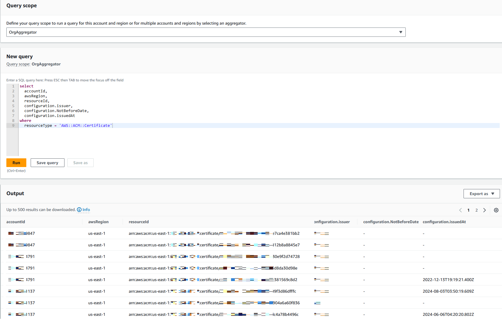
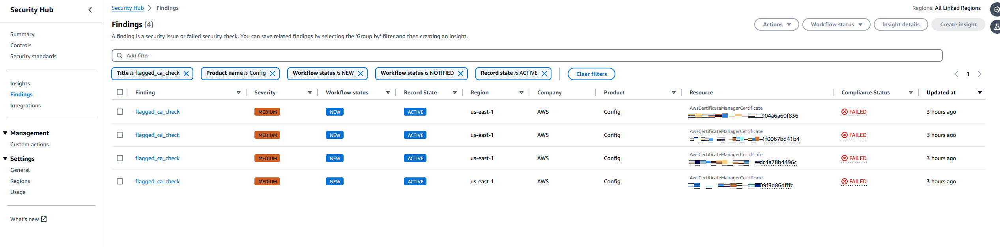
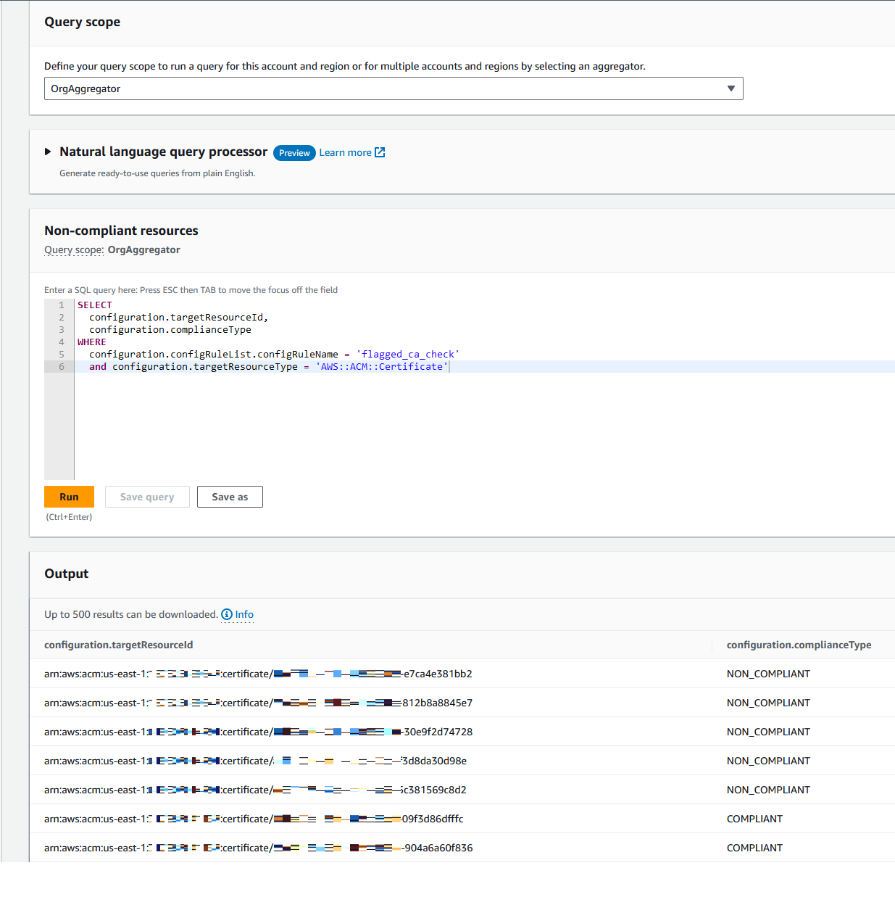

# AWS Certificate Manager - Flag Certificates by CA Issuer

## Overview

Three solutions/approaches allow you to audit the Issuer of certificates stored in AWS Certificate Manager.  The most common reasons you might do this include:  
* You have an allowed/preferred list of Certificate Authorities and need to audit this across your Organization
* You have a list of Certificate Authorities you do NOT to be used or need to flag where they are being used
  * This could be company policy or as a result of a upcoming client/browser trusted CA store change to identify impact/risk.
 
Please see this [AWS Security Blog post](https://aws.amazon.com/blogs/security/options-for-aws-customers-who-use-entrust-issued-certificates/) for more information about how to use this project, and why it might be useful for you.

## Approaches

The right approach depends on what you already have in place, level of effort you can take, and if you need an ad-hoc report or require ongoing visibility.

* [Python Script](#python-script)  
  No AWS Account setup required.  Prints or saves report to JSON/CSV for multiple accounts.  

* [AWS Config Query](#aws-config-query)  
  If you already use AWS Config, use an AWS Config Aggregator (easy to setup) to create a report across any number of accounts/regions at once.

* [AWS Config Custom Rule](#aws-config-custom-rule)  
  Deploy an AWS Config Custom Rule to flag non-compliance certificates in near real time across any number of accounts/regions at once. Query with AWS Config or AWS Security Hub!

---
### Python Script

Simple python script evaluates all ACM certificates for a given AWS Account.  By default evaluates all regions for a provided list of CA Issuer values.

#### Prerequisites

AWS Account Configurations:
* None

Client:
* [python3.10+](https://www.python.org/downloads/)
* [git](https://git-scm.com/downloads)

#### How to Use


```
# Clone GitHub repo
git clone https://github.com/aws-samples/acm-flag-ca-issuer.git  

#Create a virtual Environment
python -m venv .venv  

# Activate virtual Environment
source .venv/bin/activate  

# Install required python modules for script
pip install -r requirements.txt --no-cache-dir

# Example execution, assumes credentials are already configured
python3 acm_flag_ca_issuer.py --flagged-ca MYCA1, MYCA2  

# Example execution, specifies an AWS Credential profile to use
python3 acm_flag_ca_issuer.py --flagged-ca MYCA1, MYCA2 --profile MyCredentialsProfile
```
Example output
```
[
    {
        "domain_name": "anycompany.com",
        "alternate_domain_names": "foo.anycompany.com",
        "issued_at": "",
        "not_before": "2024-08-07 11:22:3",
        "cert_issuer": "Issuer Name Is Here",
        "flagged_ca": false
    },
    {
        "domain_name": "anycompany.com",
        "alternate_domain_names": "foo.anycompany.com",
        "issued_at": "",
        "not_before": "2024-08-07 11:22:3",
        "cert_issuer": "Flagged Issuer Goes Here",
        "flagged_ca": true
    }
]
```


#### Help
Full help for script and available arguments
```
usage: acm_flag_ca_issuer.py [-h] [--profile PROFILE]
                             [--output {json,csv,text}] [-regions REGIONS]
                             --flagged-ca FLAGGED_CA

optional arguments:
  -h, --help            show this help message and exit
  --profile PROFILE     Use the specified AWS credentials profile. By default
                        not used
  --output {json,csv,text}
                        By Default results are printed to the console. You can
                        also save them to json or csv
  --regions REGIONS      Comma separated list of AWS regions to iterate over.
                        Default is all
  --flagged-ca FLAGGED_CA
```


---


### AWS Config Query

AWS Config Advanced Queries provide an ad-hoc report of all ACM certificates and the relevant data to identify and flag by Certificate Issuer.  Using an AWS Config Aggregator, this includes results for all accounts and regions in scope to the Aggregator.

**Pros**: Out of box multi-account reporting, easily customizable report.  
**Cons**: Requires specific AWS Services already configured: AWS Config with an Aggregator

#### Prerequisites

AWS Account Configurations:
* AWS Config recorder in all member accounts with at least AWS::ACM::Certificates configured as a resource
* AWS Config Aggregator covering all Accounts in scope. e.g. [Org Aggregator](https://aws.amazon.com/blogs/mt/org-aggregator-delegated-admin/)

#### Query

```
select
  accountId,
  awsRegion,
  resourceId,
  configuration.issuer,
  configuration.NotBeforeDate,
  configuration.issuedAt
where
  resourceType = 'AWS::ACM::Certificate'
```



---


### AWS Config Custom Rule

Deploy an AWS Config Custom Rule flagging (non-compliant) certificates based on Issuer to any number of AWS accounts/regions.

#### Prerequisites

AWS Account Configurations:
* AWS Config with at least AWS::ACM::Certificates configured in the recorder
* [AWS CloudFormation Service-Managed StackSets](https://docs.aws.amazon.com/AWSCloudFormation/latest/UserGuide/stacksets-orgs-activate-trusted-access.html) is enabled

Client:
* python3.10+
* git 

#### How to Deploy

The below instructions assume you have configured credentials and are deploying from your payer account.

```
# Clone github code
git clone https://github.com/aws-samples/acm-flag-ca-issuer.git  
# Define stackset name
export StackName=acm-flag-ca-issuer
aws cloudformation create-stack-set \
    --stack-set-name $StackName \
    --template-body file://acm_flag_ca_issuer.yaml \
    --permission-model SERVICE_MANAGED \
    --capabilities CAPABILITY_IAM \
    --auto-deployment Enabled=True,RetainStacksOnAccountRemoval=False \
    --parameters ParameterKey=MatchLogic,ParameterValue='exact' \
        ParameterKey=FlagIndicator,ParameterValue=NON_COMPLIANT

#Specify the OU (or in this case root ID) to deploy to
export OrgId=`aws organizations list-roots --query 'Roots'[0].Id`
# Uncomment below to specify custom OU(s)
#export OrgId=ou-1234-12341234,ou-abcd-abcdabcd


#Deploy StackSet, Default is all accounts and all default regions

aws cloudformation create-stack-instances \
    --stack-set-name $StackName \
    --deployment-targets OrganizationalUnitIds=$OrgId \
    --regions ap-south-1 ca-central-1 eu-central-1 us-west-1 \
    us-west-2 eu-north-1 eu-west-3 eu-west-2 eu-west-1 \
    ap-northeast-3 ap-northeast-2 ap-northeast-1 sa-east-1 \
    ap-southeast-1 ap-southeast-2 us-east-1 us-east-2 \
    --operation-preferences RegionConcurrencyType=PARALLEL

```

#### Consolidated Report

##### AWS Security Hub


AWS Security Hub by default shows non-compliant resources for any AWS Config rules.  AWS Security Hub provides a central location to view security findings.  With this CloudFormation Template deployed, non-compliant ACM certificates can be viewed and used to trigger alerts (if desired).


##### AWS Config Query

If you don't use AWS SEcurity Hub, you can still see compliance information created by the deployed AWS Config rules

#### Query

```
SELECT
  configuration.targetResourceId,
  configuration.complianceType
WHERE
  configuration.configRuleList.configRuleName = 'flagged_ca_check'
  and configuration.targetResourceType = 'AWS::ACM::Certificate'
```

